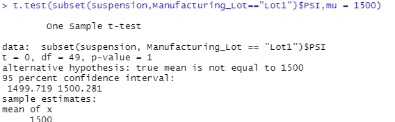

## Linear Regression to Predict MPG

- Which variables/coefficients provided a non-random amount of variance to the mpg values in the dataset?
  
Vehicle weight, spoiler angle, and AWD provided non-random amount of variance to the mpg values as the probability that the coefficients contribute a random amount of variance to the linear model, i.e. the p-value, is higher than the alpha value of 0.05. However, vehicle_length and ground_clearance are the two variables that have the most random variance.

- Is the slope of the linear model considered to be zero? Why or why not?  
The p-value for the slope is 5.35e-11 which is miniscule compared to the 0.05 alpha level and the null hypothesis is rejected. Hence, the slope of our linear model is not considered to be zero.

- Does this linear model predict mpg of MechaCar prototypes effectively? Why or why not?  
Looking at the R-squared value (0.7149), we can say that this particular model can predict 71.5% of future data points and is certainly quite effective. However, there could also be other variables that can help explain the variability of the mpg of a vehicle that have not been included in our model.

## Summary Statistics on Suspension Coils

As we can see from the lot_summary dataframe, the third lot has variance at 170.29 which is higher than the design specifications of the MechaCar. Only lots 1 and 2 have variance under 100 psi and follows design specifications for the MechaCar.

## T-Tests on Suspension Coils

 
As seen from the screenshot above, the t-test for the PSI for all manufacturing lots show no statistical significance as the p-value is not lower than the 0.05 alpha level. Hence, we fail to reject the null hypothesis and that the mean of the PSI across all manufacturing lots is not different from the population mean.

 
As seen from the screenshot above, the t-test for the PSI for lot 1 show no statistical significance as the p-value is not lower than the 0.05 alpha level. Hence, we fail to reject the null hypothesis and that the mean of the PSI for manufacturing lot 1 is not different from the population mean.

 
As seen from the screenshot above, the t-test for the PSI for lot 2 show no statistical significance as the p-value is not lower than the 0.05 alpha level. Hence, we fail to reject the null hypothesis and that the mean of the PSI for manufacturing lot 2 is not different from the population mean.

 
Lastly, the t-test for the PSI for lot 3 show statistical significance as the p-value lower than the 0.05 alpha level. Hence, we reject the null hypothesis and state that the mean of the PSI for manufacturing lot 3 is different from the population mean.

## Study Design: MechaCar vs Competition
 
With modern day cars having beautiful high tech interiors and powered by electricity, people now a days are more interested with the perks of having a car with technologies such as Apple CarPlay or Android Auto, superb interior design, and high fuel efficiency. Not many people are looking for high horse powered cars as cars such as those will cost a lot to fuel up and eventually have high cost in maintinence. However, since it is hard to quantify the car's interior design and technologies in it, for this case study we will focus on fuel efficiency as more people are starting to be more conscious about carbon emission and global warming.

 
-What metric or metrics are you going to test?
In this case study, fuel efficiency both in the city and highway will be the metric we are going to test.

-What is the null hypothesis or alternative hypothesis?
Ho1: MechaCar and its competitors have equal mean in city fuel efficiency
Ha1: MechaCar and its competitors have do not have equal mean in city fuel efficiency
Ho2: MechaCar and its competitors have equal mean in highway fuel efficiency
Ha2: MechaCar and its competitors have do not have equal mean in highway fuel efficiency

-What statistical test would you use to test the hypothesis? And why?
First we will conduct a two-sample t-test to see whether the MechaCar average city fuel efficiency is higher than its competitors. Second we will perform a two-sample t-test to see whether the MechaCar average highway fuel efficiency is higher than its competitors.

-What data is needed to run the statistical test?
We need both city and highway fuel efficiency rating from all MechCar prototypes and also its competitors.
